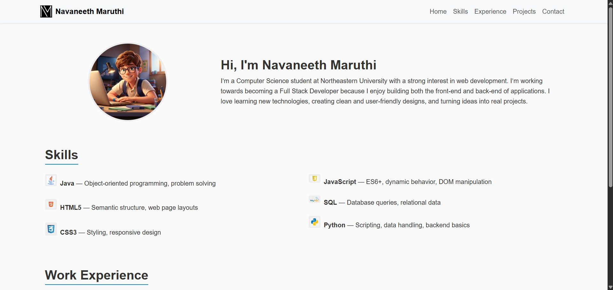

# Personal Portfolio Website

## 📌 Project Objective
This project is a **personal portfolio website** built to showcase my skills, work experience, and featured projects.  
It demonstrates the use of **HTML, CSS, JavaScript (ES6 modules), and Bootstrap 5** to create a responsive, professional-looking homepage.  
---
## Author: Navaneeth Maruthi
Class: CS5610 Class Link: https://johnguerra.co/classes/webDevelopment_online_fall_2025/ 
---
## Homepage
https://navaneethmaruthi.github.io/Web-Development/portfolio/

## 🖼️ Screenshot
  

---

## ⚙️ Tech Requirements
- NodejJs
- NPM
---

## 🚀 How to Install/Use
1. Clone this repository:
   git clone https://github.com/NavaneethMaruthi/Web-Development.git
2. cd portfolio
3. npm install -g http-server (if installed)
4. http-server

---
